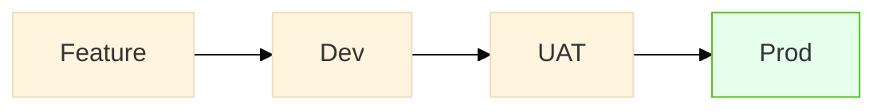
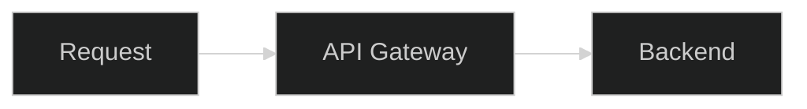
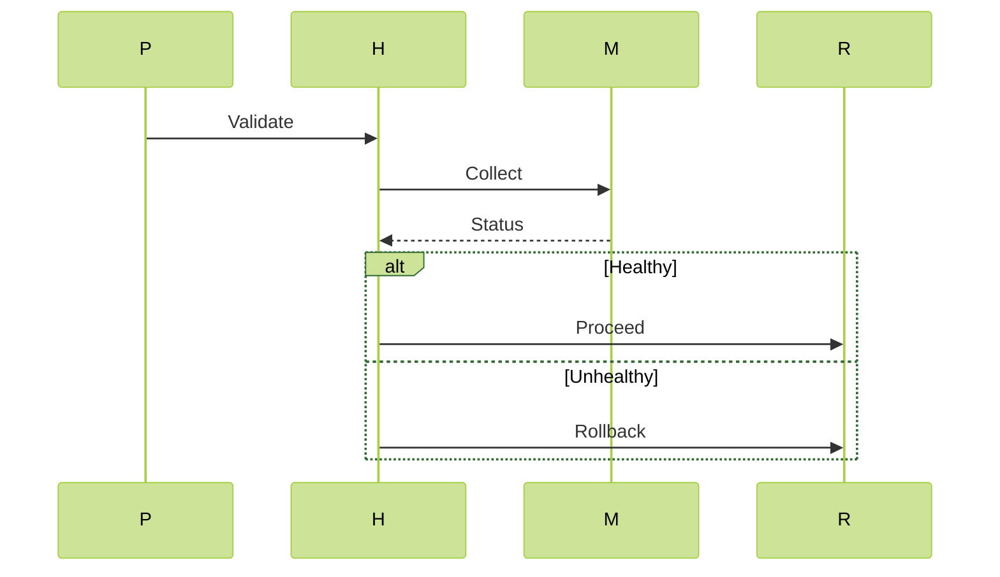

# Technical Architecture Documentation

## CI/CD Pipeline Design

[View Full Diagram](diagrams/ci-cd-pipeline.mmd)

**Engineering Decisions**:  
- UAT consolidation reduced testing environments by 40%  
- Security scans shifted left to feature branches  
- Cloud monitoring replaces vendor-specific tools  

## Security Architecture

[View Full Diagram](diagrams/security-proxy.mmd)

**Threat Mitigation**:  
- WAF rules blocking OWASP Top 10  
- JWT validation with 256-bit encryption  
- Audit logging for all access attempts  

## Rollout Safety Mechanism

[View Full Diagram](diagrams/production-rollout.mmd)

**Rollback Triggers**:  
- Latency > 500ms  
- Error rate > 1%  
- CPU > 80% sustained  