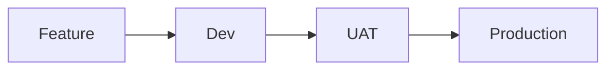
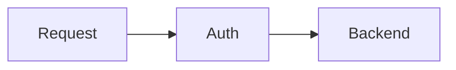
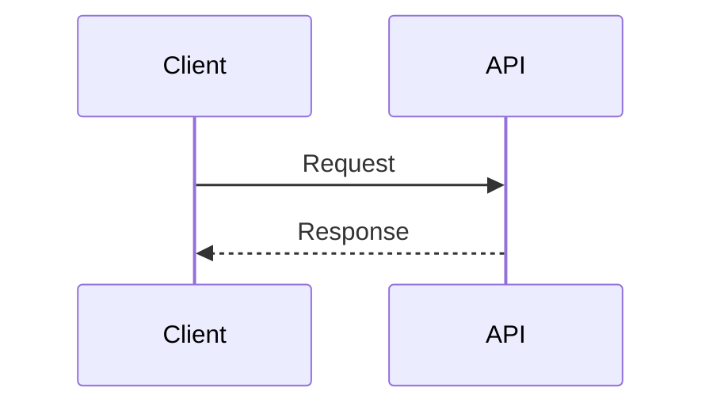

# Technical Diagram Explanations  
*Conceptual overviews of industry patterns*  

## CI/CD Workflow  

**Core Concept**:  
Standard progression of code through testing environments before release.  

## Security Layer  

**Core Concept**:  
Authentication gateway protecting internal resources.  

## API Flow  

**Core Concept**:  
Basic request-response pattern in distributed systems.  

---  
### Navigation  
[Return to Portfolio Overview](README.md)  
