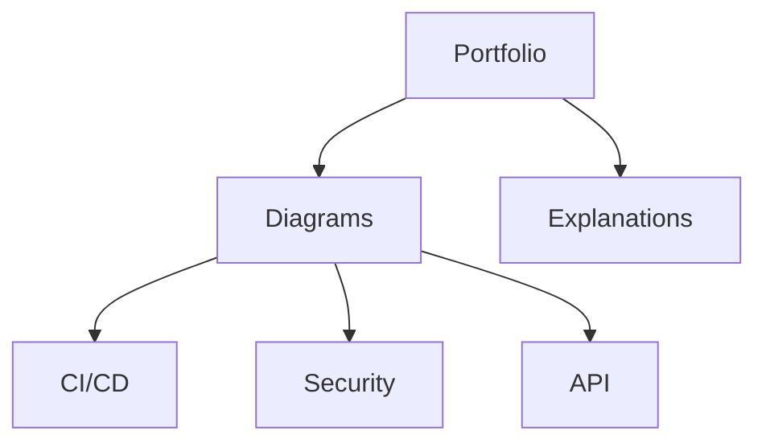

# Technical Diagram Portfolio  

## Interactive Diagrams  
| Diagram Type          | View Diagram               | Technical Explanation       |  
|-----------------------|----------------------------|-----------------------------|  
| CI/CD Workflow        |  |  |  
| Security Layer        |  |  |  
| API Request Flow      |  |  |  

---  
> **Disclaimer**: Abstract representations of technical concepts - not specific implementations.  
