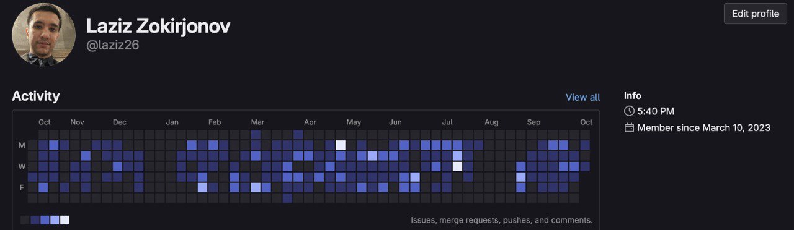

# Technical Patterns from Professional Experience

## Cloud Automation
- **Concept**: Infrastructure-as-code provisioning
- **General Tools**: AWS, Serverless, CI/CD systems
- **Outcome Focus**: Deployment optimization

## Access Security
- **Concept**: Policy-based permission management
- **General Approach**: RBAC implementation
- **Outcome Focus**: Enhanced data protection

*Professional development rhythm (2023-present)*

*Note: All content demonstrates industry-standard patterns, not specific implementations.*
