# Technical Architecture Documentation  
Detailed explanations of architectural patterns and system designs.

---

## 1. API Security Layers  
**Diagram**: [`api-security.mmd`](../diagrams/api-security.mmd)  
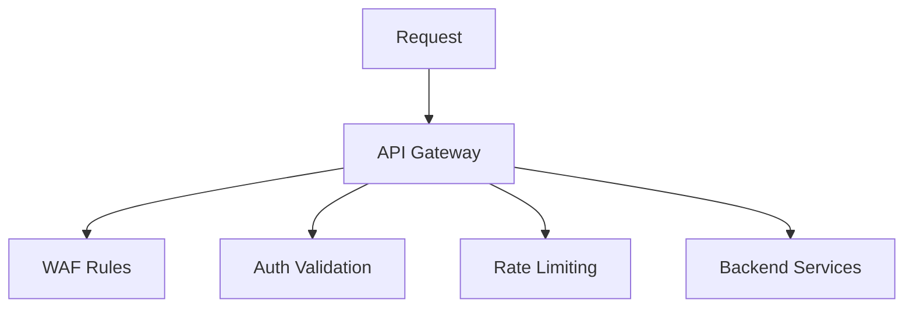
***Technical Analysis***:
- Gateway Layer Protection
    - WAF rules block common exploits (SQLi, XSS)
    - Auth validation verifies JWT/OAuth 2.0 tokens
    - Rate limiting prevents DDoS attacks
- Defense-in-Depth
    - Sequential security checks before backend access
    - Isolation of public-facing components

## 2. Entra ID Authentication Flow:
**Diagram**: [`authentication-flow.mmd`](../diagrams/authentication-flow.mmd)
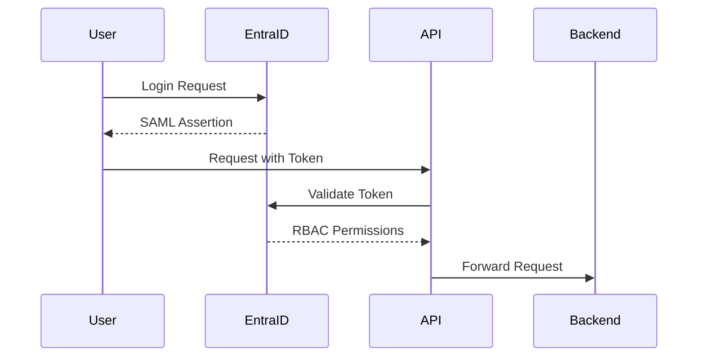
***Technical Analysis***:
- SAML Workflow
    - SP-initiated single sign-on
    - Encrypted assertion payload
- Zero-Trust Validation
    - Online token validation
    - Dynamic RBAC permission mapping
- Enterprise Integration
    - Microsoft Entra ID compatibility
    - Session-less architecture

## 3. Full-Stack Architecture:
**Diagram**: [`fullstack-architecture.mmd`](../diagrams/fullstack-architecture.mmd)
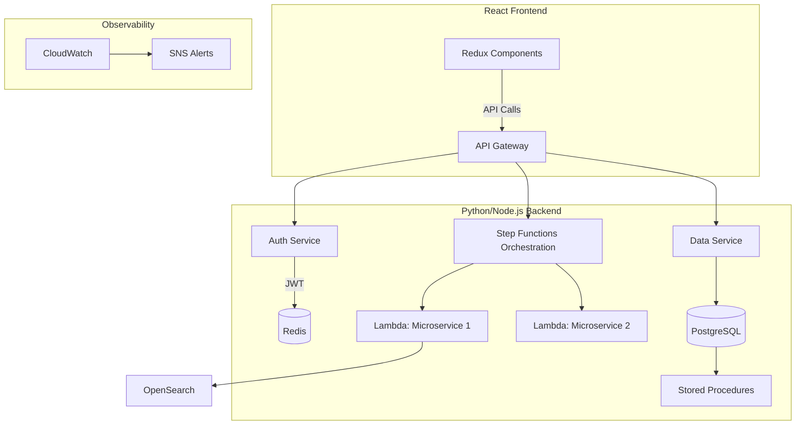
***Technical Analysis***:
- Frontend-Backend Integration
    - React/Redux → API Gateway communication
    - JWT-based session management
- Serverless Orchestration
    - Step Functions state machine
    - Lambda function chaining
- Data Layer
    - PostgreSQL with optimized SPs
    - OpenSearch indexing pipeline
- Monitoring
    - CloudWatch metric collection
    - SNS alert propagation

## 4. CI/CD Pipeline:
**Diagram**: [`ci-cd-orchestration.mmd`](../diagrams/ci-cd-orchestration.mmd)
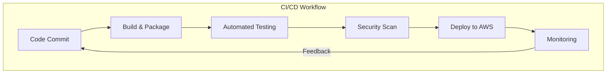
***Technical Analysis***:
- Automated Stages
    - Docker-based build artifacts
    - Jest/Cucumber test execution
- Security Gate
    - SAST/DAST scanning
    - Break-build on critical findings
- Feedback Loop
    - Production monitoring metrics
    - Automated pipeline tuning

## 5. CI/CD Security:
**Diagram**: [`ci-cd-security.mmd`](../diagrams/ci-cd-security.mmd)
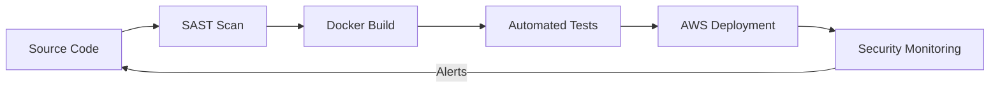
***Technical Analysis***:
- Shift-Left Security
    - Static analysis before build
    - Secrets detection
- Immutable Artifacts
    - Signed Docker images
    - Hash-verified deployments
- Runtime Protection
    - CloudWatch anomaly detection
    - Automated vulnerability patching

## 6. Database Access:
**Diagram**: [`database-access.mmd`](../diagrams/database-access.mmd)
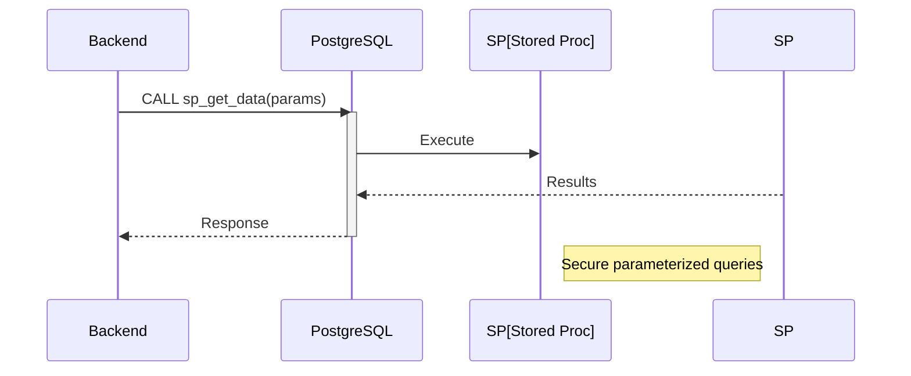
***Technical Analysis***:
- Secure Access Pattern
    - Stored procedure abstraction layer
    - Parameterized input validation
- Performance Optimization
    - Prepared statement reuse
    - Index-assisted query execution
- Attack Surface Reduction
    - No direct table access
    - Principle of least privilege

## 7. Deployment Process:
**Diagram**: [`deployment-process.mmd`](../diagrams/deployment-process.mmd)
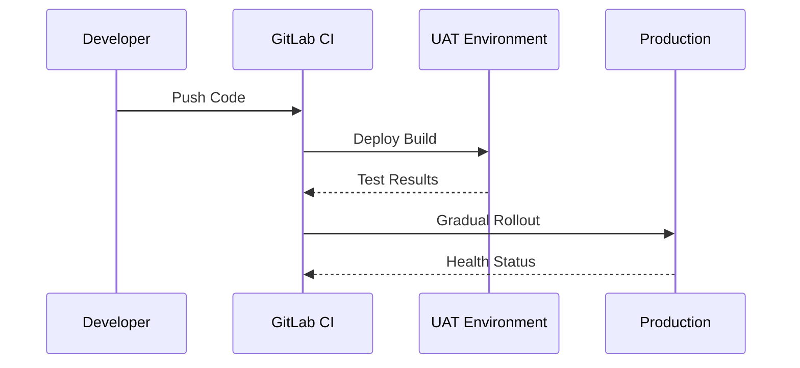
***Technical Analysis***:
- Staged Deployment
    - UAT environment validation
    - Canary release strategy
- Health Verification
    - Synthetic transactions
    - Performance baseline checks
- Rollback Protocol
    - Automated version reversion
    - Failure root cause analysis

## 8. Error Handling:
**Diagram**: [`error-handling.mmd`](../diagrams/error-handling.mmd)
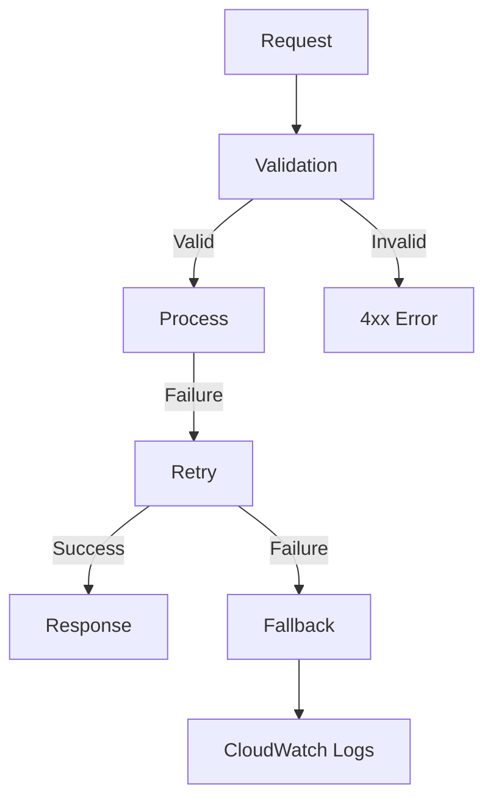
***Technical Analysis***:
- Resilience Pattern
    - Input validation gateway
    - Exponential backoff retries
- Fallback Mechanisms
    - Cached response delivery
    - Default payload templates
- Diagnostic Logging
    - Structured error taxonomy
    - CloudWatch Logs Insights

## 9. Infrastructure as Code:
**Diagram**: [`infrastructure-as-code.mmd`](../diagrams/infrastructure-as-code.mmd)
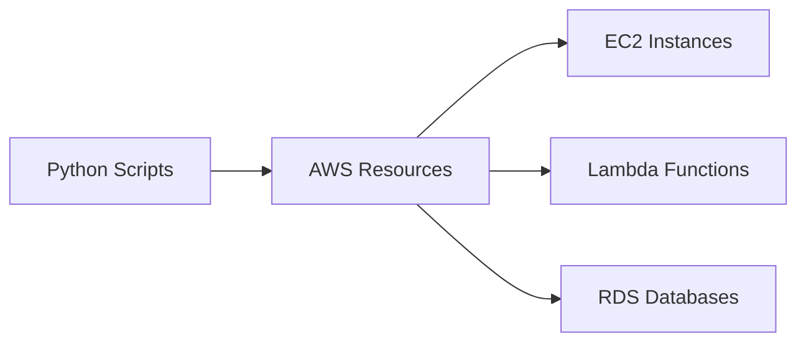
***Technical Analysis***:
- Programmatic Provisioning
    - Boto3/Terraform execution
    - Environment parity enforcement
- Security Foundations
    - Automated guardrail policies
    - Encryption-by-default
- Lifecycle Management
    - Version-controlled templates
    - Drift detection alerts

## 10. Monitoring System:
**Diagram**: [`monitoring-system.mmd`](../diagrams/monitoring-system.mmd)
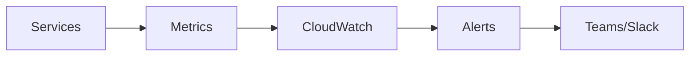
***Technical Analysis***:
- Metric Collection
    - Custom CloudWatch metrics
    - Application performance indices
- Alerting Framework
    - Threshold-based notifications
    - Escalation policies
- Visualization
    - Automated dashboard generation
    - Anomaly detection

## 11. Security Pattern:
**Diagram**: [`security-pattern.mmd`](../diagrams/security-pattern.mmd)
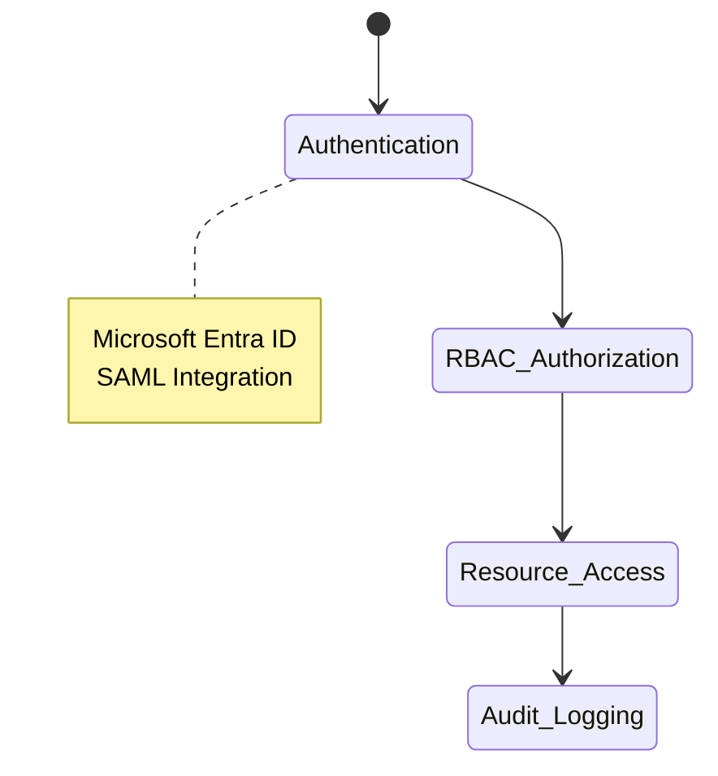
***Technical Analysis***:
- Access Control Workflow
    - Sequential state transitions:
        - Authentication → Authorization → Access → Audit
    - Microsoft Entra ID integration
- RBAC Implementation
    - Role-permission matrix enforcement
    - Attribute-based access conditions
- Audit Trail
    - Immutable access logs
    - Automated compliance reports

## 12. LocalStack Testing Principle:
**Diagram**: [`localstack-testing-principle.mmd`](../diagrams/localstack-testing-principle.mmd)
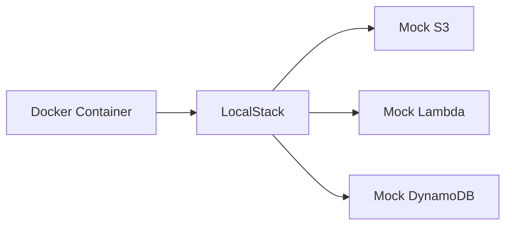
***Technical Analysis***:
- Local AWS Emulation
    - Full-featured AWS service mocks
    - Service parity: S3, Lambda, DynamoDB, etc.
- Testing Workflow
    - Docker-based test isolation
    - Jest integration for validation
- CI/CD Integration
    - Pre-commit validation hooks
    - GitHub/GitLab CI pipeline compatibility

